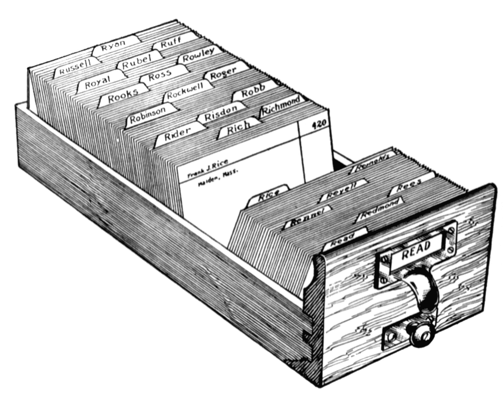
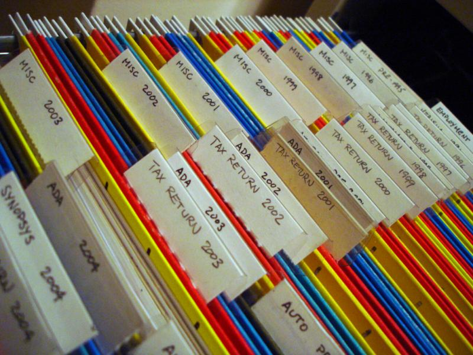

# Choosing a Firestore data structure


<br>

## There are several ways to structure your Firestore data.
- Single Collection
- Multiple Collections
- Subcollections

---

<br>

## Let's explore the pros and cons for each.

<br>

---

<br>

## Single Collection:


A collection is essentailly a parent database table that may or may not have child folders. In a Firestore collection, you can create documents with nested objects like arrays or maps. 

<br>

## A simplified illustration would be a drawer in a file cabinet.

--- 

<br>

### The drawer can be organized with labeled folders.


<br>

---

<br>

### Or... The drawer can be disorganized with random sheets of paper:


---

<br>

## In Firestore, your file structure can look like this:
```
users
│   
└─── name:
|        └───  first: George
|        └───   last: Smith
|
└─── dob: 1962
|
|
└─── education:
              └─── 0: Elementary School
              └─── 1: Middle School
              └─── 2: High School
              └─── 3: Undergraduate
              └─── 4: Bootcamp
              └─── 5: Masters
              └─── 6: PhD
```

---

<br>

## Pros:
If you have fixed, static data that won't change over time, this is a great approach. 
<br>
For example:
- Basic user info.
- Archived data for artworks in museums.
- Discography for music releases on Discogs.

<br>


<br>

## Cons:
This structure will make it harder to scale when data grows. If you have a large single document, retrieval times will become slower.


<br>

## Just picture a single file cabinet looking like this...


---

<br>

## Subcollections
Subcollections are like child database tables. They are nested within a parent document. If you know ahead of time that data will expand and form relationships, subcollections are a great option.

<br>

A Firestore subcollection could look something like this:

```
departments
|
└─── technology
        |
        └─── managers
        |      |
        |      └─── 5:
        |            |
        |            └─── name:
        |            |        └─── first: Amanda
        |            |        └───  last: Wilson
        |            |
        |            └─── dob: 1962   
        |            |
        |            └─── createdOn: Unix timestamp   
        |
        └─── employees
                |
                └─── 162:
                        │   
                        └─── name:
                        |        └───  first: George
                        |        └───   last: Smith
                        |
                        └─── dob: 1982
                        |
                        └─── createdOn: Unix timestamp
```

<br>

## Pros:
- The parent document's size will not change.
- You get access to full query capabilities.
- You also get to execute [collection group queries](https://firebase.google.com/docs/firestore/query-data/queries).



## Helpful links:
[Firestore docs](https://firebase.google.com/docs/firestore/manage-data/structure-data)
