# Getting Started with Firebase, Firestore and React
# 1: Set up Firebase


## Let's start with the [Firebase website](https://firebase.google.com/).

---

## Put simply, <i>Firebase</i> is a cloud-based application platform.
It's competitors are MongoDB, Parse, Heroku, AWS Amplify, etc.  

<br>

## <i>Firestore</i> is a database product offered by Firebase.
There are many tools and frameworks that Firebase offers, and this walkthrough will cover [Firestore](https://cloud.google.com/firestore/docs#:~:text=Firestore%20is%20a%20NoSQL%20document,describes%20relationships%20between%20data%20objects.).
* If you would like to research Firebase's other database solution, <i>Realtime Database</i>, you can learn more [here](https://firebase.google.com/docs/database/rtdb-vs-firestore).

<br>

## <i>Firestore</i> only executes code when an event is triggered. 
You can write scripts to interact with other products like Google Sheets.
<br>
You can also send HTTPS requests to store and retrieve data. 
<br>
It's really fast, convenient and pretty cool!

<br>

---

## Alright, now that you're at the website, create an account if you haven't or log in to access the dashboard.

---

<br>

## Dashboard

This is what the Firebase dashboard looks like:

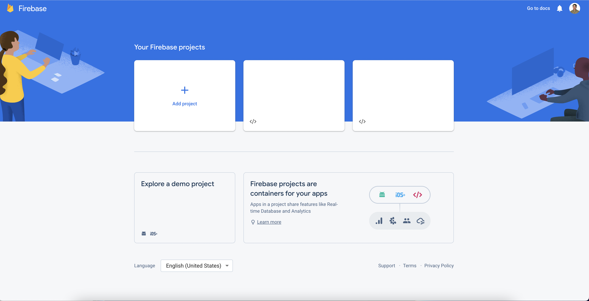

<br>

Begin by clicking the "Add Project" card under Your Firebase Projects.
<br>
You will see the following page and you can enter a name for your project:


<br>

Once you click continue, step 2 is confirming your Google Analytics selection. 
<br>
We are going to disable this to quickly move forward. 
<br>
However, please look into Google Analytics depending on your project requirements. 
<br>
Here is a link to [Google Analytics](https://analytics.google.com/analytics/web/provision/#/provision).

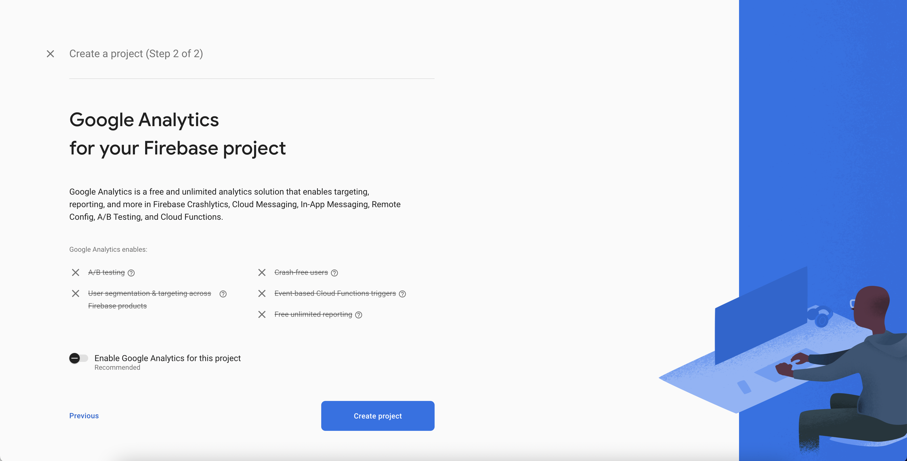

<br>

It will take a little bit for the project to get initialized. 
<br>
Now's a good time to fill up on coffee, tea, whatever makes you happy!

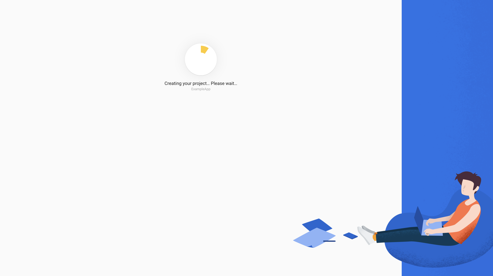

<br>

---
## Project dashboard
Ok! Once your project is created, you will land on this page.

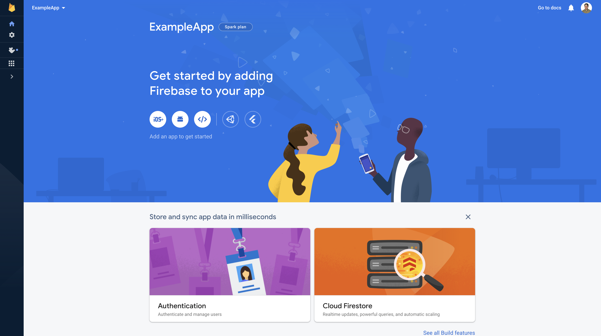

<br>

## Wow we're almost done setting up Firebase!

<br>

The next thing you need to do is click on the web app ```</>``` button.
<br>

It's under the ```Get started by adding Firebase to your app``` header.

The following short form will appear - you just need to give your app a nickname. 
<br>
Make sure to leave the Firebase Hosting box unchecked for now. 

* If you need Firebase Hosting, check out [this link](https://firebase.google.com/products/hosting?gclid=CjwKCAjws--ZBhAXEiwAv-RNLy56zPOphuzMTXKtA3V11PFk3EwZ8uA2x19qUDrp2rgkbxws2pGWGBoCpe8QAvD_BwE&gclsrc=aw.ds).

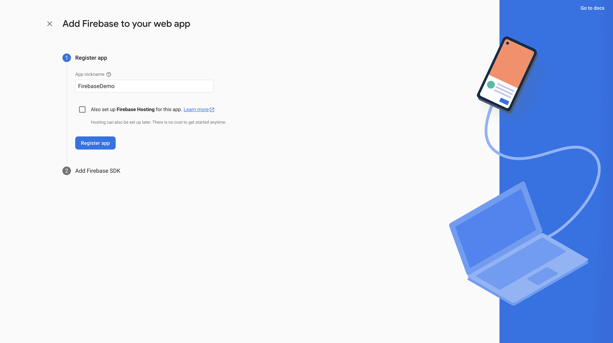

<br>

## Now you will see a page with two blocks of code to copy. 
* The first is the Firebase npm package. 
<br>

* The second one has all of your keys and credentials for this Firebase project. 

<br>

This image is edited for security reasons, but all of your credentials are wrapped in green double quotes. 
<br>
You will want to keep them secure in a .env file.

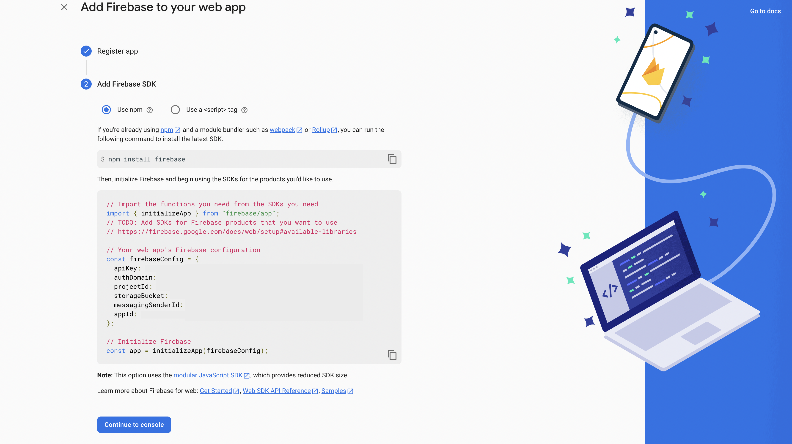

<br>

## Leave this tab open and now let's move on to connecting your React app!

---

<br>

# 2: Connect Firebase to a React app

In your terminal, bootstrap React with:
- ```npx create-react-app <your project name>```.

Otherwise, this repo comes with a directory called React-Firebase-Tutorial. 
<br>

You're good to ```npm install``` this basic template if you would like.

<br>

### Copy the npm code from the Firebase tab you have open.
If you forgot it, it's here:
- ```npm install firebase```


<br>

### Create a .env file and make sure it is added to your .gitignore file. Don't expose those credentials!
- ```touch .env && code .env```

<br>

Make sure to look at the .env.example file to match the keys for your Firebase credentials. 
<br>
Since we are working with React, make sure the keys start with ```REACT_APP_``` followed by Firebase keys.
- Replace the colons ```:``` with an equal sign ```=``` for all keys.
- Remove the double quotes for credentials and do not leave a comma or semi-colon.

<br>

### Now, create a file called firebase.js in the ```src``` directory.
- ```touch firebase.js && code firebase.js```


Ok perfect! Once the file is open, copy paste the second block of code into this firebase.js file. 
<br>
However, make sure to remove all of your credentials in double quotes with the .env variables.
- It will look like:
```
const firebaseConfig = {
  apiKey: process.env.REACT_APP_API_KEY,
  authDomain: process.env.REACT_APP_AUTH_DOMAIN,
  projectId: process.env.REACT_APP_PROJECT_ID,
  storageBucket: process.env.REACT_APP_STORAGE_BUCKET,
  messagingSenderId: process.env.REACT_APP_MESSAGING_SENDER_ID,
  appId: process.env.REACT_APP_APP_ID
}
```

<br>

### Make sure your .env file is good and the firebase.js file looks like this:
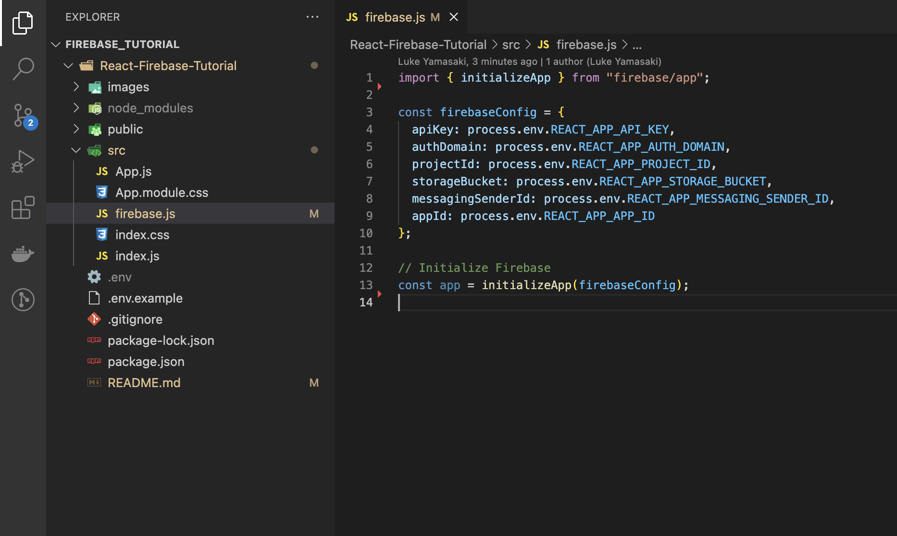

<br>

## Now Firebase and your React app are connected. Piece of cake right?

---

<br>

# 3: Add Firestore to your Firebase project.
Since this walkthrough covers Firestore, we need to initialize it within our current Firebase project.

<br>

### Go to your Firebase project dashboard.
* Please note that Firestore and Cloud Firestore are the same thing.

You will most likely see <u><i>Cloud Firestore</i></u> on this page as a suggested product. 
<br>

If you don't for some reason, click the navbar and open the <i>```Build```</i> accordion to select <i>```Firestore Database```</i> . 
<br>

If you still don't see it, you can click the <i>```All products```</i>  tile icon and you'll see it listed on the new page. 

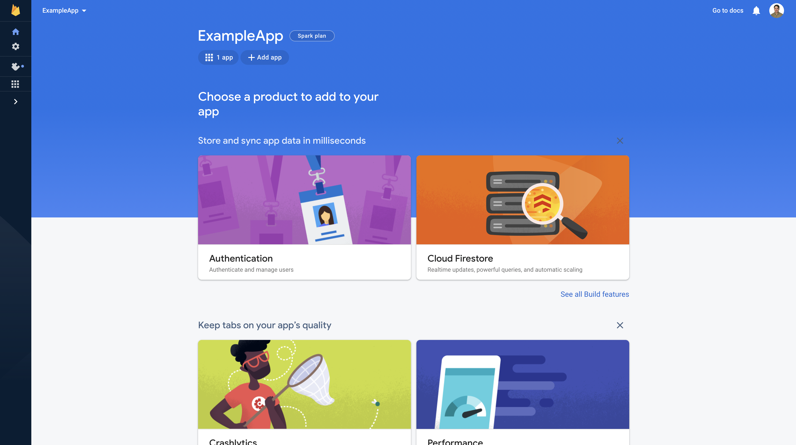
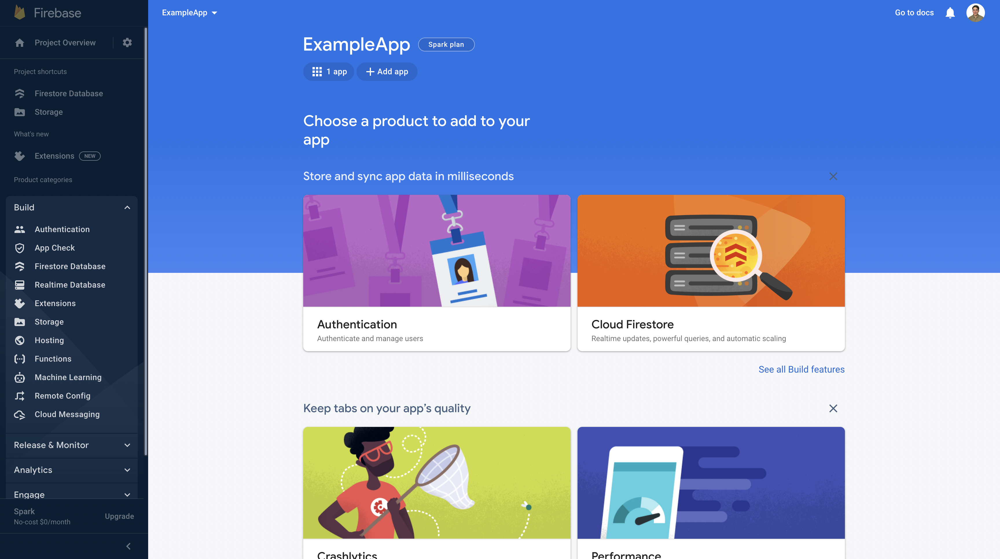

---

<br>

## Wait for the banner to load.
Sometime it takes a few seconds for the information within the orange banner to load. 
<br>
Just be patient and you will see the <i>```Create database```</i> button appear.

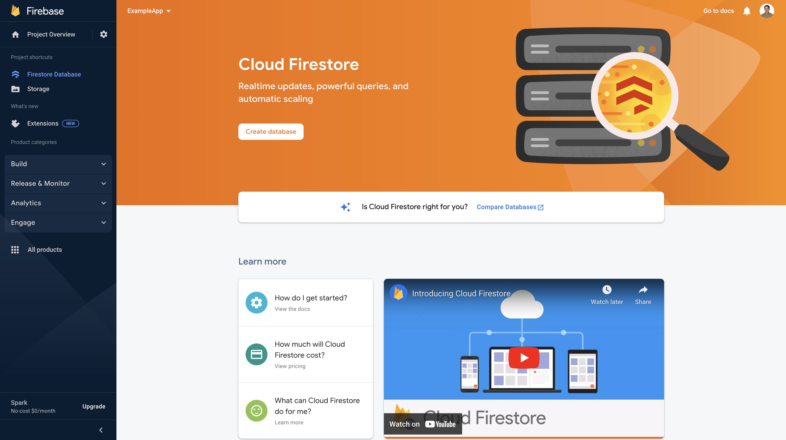

---

<br>

## Configuring the database
If you see a modal pop up, you're on the right track. 
<br>
This two part form will ask you to select production or test mode, as well a geographical server location. 
<br>

We are going to select ```Start in test mode``` , which creates a temporary database that will expire in 30 days. 
<br>
This is just for practice.

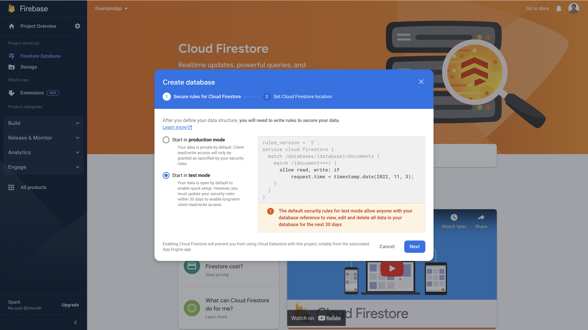

---

<br>


## Select a server locaiton
Next, you need to select a server location based on the location of your user or userbase. 
<br>
If you know the region with the highest number of requests, select the best fitting Firestore location.
<br>
This will reduce latency and increase reliability. 
<br>
Please note that you cannot change the Firestore location once you establish a connection.

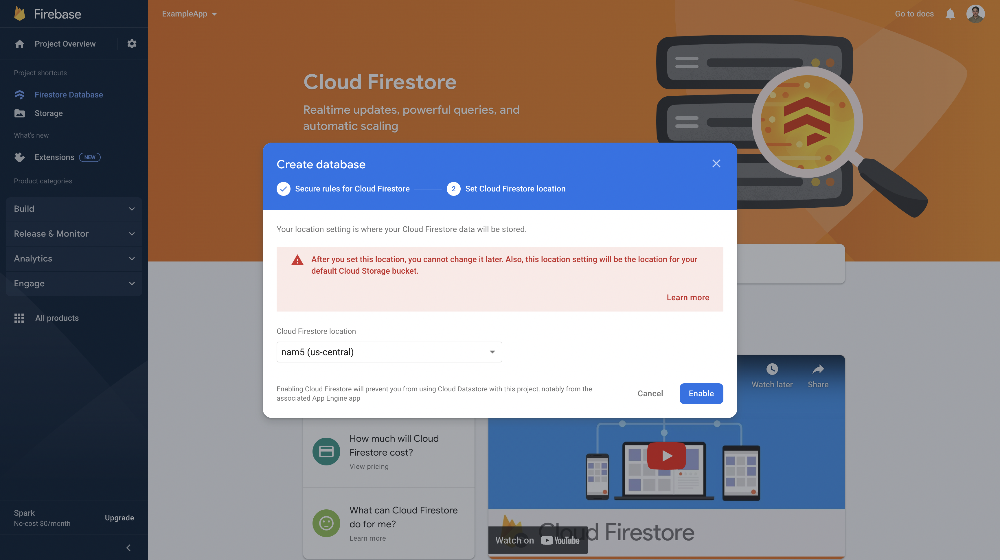

---

<br>

## Loading...
It will take just a few moments for your Firestore database to get created. 
<br>
Another great opportunity for a quick break here!

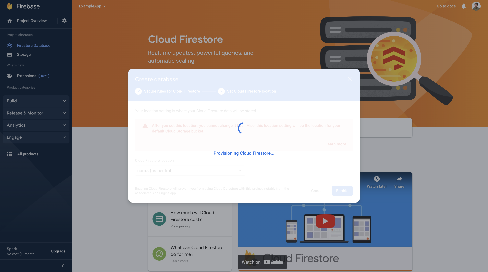

---

<br>

## Ready to go!
If you're familiar with Postbird, this is basically that but with a cleaner UI. 
<br>
You can manually enter data here, but we are looking to do that in a React app.
<br>
The next phase will walk you through connecting Firestore to a React app.

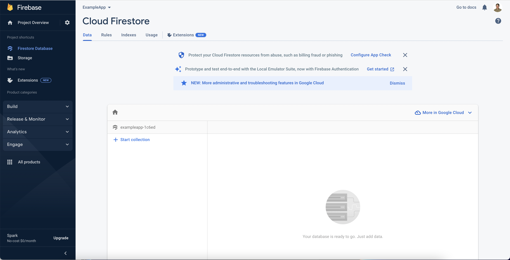

---

<br>

# 4: Integrating Firestore in React.
Navigate back to the ```firebase.js``` file in your ```src``` directory. We have two more extra lines of code to add here.
#### At the top of the file import ```getFirestore```.
- import { getFirestore } from "@firebase/firestore";
#### At the bottom of the file, export ```firestore```.
- export const firestore = getFirestore(app);

<br>

## If you would like to follow the offical doc, you can call firestore ```db``` instead
- export const db = getFirestore(app);
- Purely your preference, but don't forget what you named it.

<br>

## Double check that your file matches this image:

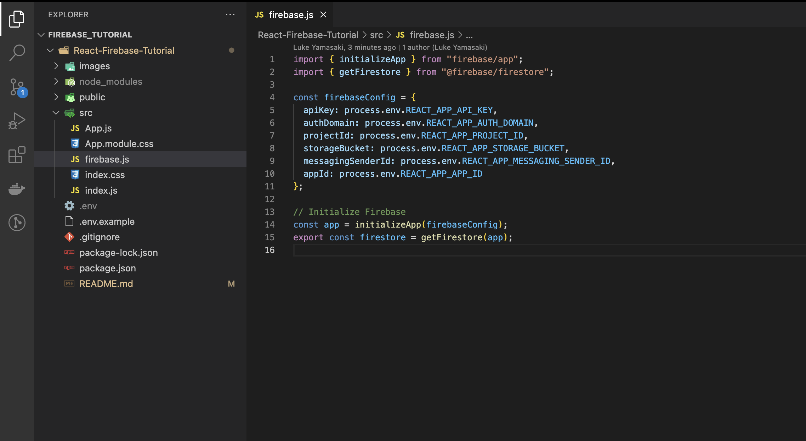

<br>

---

# Light work - Firebase and Firestore are so fast to set up!


<br>

# Alright folks, that wraps up the setup phase!
## Move on to: [Part 2: User authentication](./Part%202%3A%20User%20authentication.md)