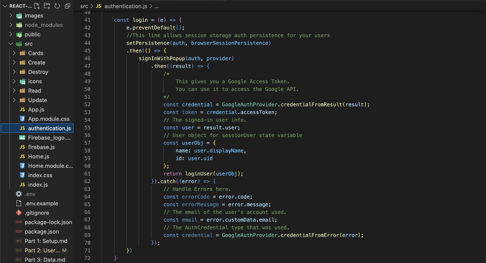

# User Authentication


## If you write backend code, there are many issues to consider.
- Middleware, CSRF, hashing credentials, security vulnerabilities
- JWT tokens, cross-site cookies, session storage, local storage 
- Database architecture
- Querying methods
- Data validation
- Error handling
- API routes

## The list goes on...

---
## But Firebase makes this really simple for you!
## So, let's get started!

---

<br>

# 1: Firebase setup
## Navigate to your dashboard and click on your project


<br>

### Open the ```Build``` according menu and select ```Authentication```


<br>

### Click the ```Set up sign-in method``` button


<br>

## Look through all of the options
For this tutorial, we are going to select ```Google```.


<br>

### Toggle the ```Enable``` option in the upper right corner
Once you see it highlighted in blue, there will be two inputs to fill in.
<br>


<br>


### Create a name for the ```Project public-facing name``` section.


<br>


### Also, fill out the ```Project support email```.


<br>

### There are two optional settings:
Skip these if you are just practicing.
- ```Safelist client IDs from external projects```
- ```Web SDK configuration```

<br>

## Firebase will automatically generate a clientID and a secret key for you.
<br>
If you are employing Node.js, you cannot integrate the Firebase JavaScript SDK.

<br>

You need to read this document and follow the steps if you have not initialized a project already:
- [Google authentication SDK](https://developers.google.com/identity/sign-in/web/sign-in)
<br>

If you have a Google API account and already have a clientID and key, find it here:
- [Google Developer Console](https://console.cloud.google.com/projectselector2/apis/dashboard?pli=1&supportedpurview=project).


<br>

### * These are basically for integrating a Firebase project as a microservice or if you are developing with Node.js or a similar non-browser environment.

---

<br>

# 2: React integration
## Once Google authentication is all set up, we can move to authentication in the React app.

---

## There are different approaches to authenticating users with Gmail.
- Pop up modal
- Redirect user
- Handle sign-in manually
- Firebase in Node.js

<br>

### In addition, you can npm install Google's UI or build your own.
This repo contains simple custom login and log out buttons.

---
<br>

## One of the most common ways to authenticate is via a modal
We will move forward with this approach.

<br>

# Logging in

## Navigate to your ```src``` folder
You can structure your folders as you wish, but you will find a file called ```authentication.js``` in the ```src``` directory.
<br>

Some people prefer to put these in a ```utils``` folder, so now is a good time to decide how you want to organize your files.

<br>

## There are four imports in this file
```
import { 
    getAuth, 
    signInWithPopup, 
    signOut, 
    GoogleAuthProvider 
} from "firebase/auth";
```

The ```GoogleAuthProvider``` is an object that you will initialize, and the other three imports are built-in methods. The name conventions are very clear here.

<br>

## Read the comments if you have scoping requirements, language customizations or additional form parameters
Otherwise, scroll down to line 34.<br>
You will see this globally scoped variable:
```
const auth = getAuth();
```

The auth variable stores the Auth instance associated with the provided Firebase app.

---

## Next, take a look at the ```Login``` functional component
This React app doesn't employ state management libraries, so there is a ```loginUser``` function being passed as a prop. This allows lifting the session user state up from this child component, but you are encouraged to incorporate Context API or something like MobX or Redux for more robust apps.

<br>

## To log a user in, start off by declaring a provider variable by creating a new instance of the GoogleAuthProvider() object
```const provider = new GoogleAuthProvider();```

<br>

## Next, simply create a function that contains the signInWithPopup Firebase method.
<br>
In this tutorial, there is a function called login:

<br>

We start off by invoking the signInWithPopup() method by passing the ```auth``` and ```provider``` variables.

<br>
Then, we take the result and retrieve the credential object in line 47.

<br>
You can dig into the credential object to retrieve a token to access the Google API. If you don't have a use for it, you can ignore that step.

<br>
In this tutorial's case, the result object needs to get parsed to retrive user information. The user name and ID are what we would like to access.

<br>

You are free to incorporate state management logic here and connect this function to a store in your ```src``` folder.

<br>
It's also a good idea to catch errors and handle them in appropriate manners.

<br>

## When you're finished with this step, you can apply an ```onClick``` event listener to a button you made or imported from a UI library. That's all there is to it!

---
<br>

# Logging out
## If you managed to set up your app to switch routes or modes after log in, you are good to continue!

---

<br>

## Logging a user out in Firebase is even more simple

<br>

## Make sure you imported the signOut() built-in method
- Create a custom logout handler function based on your needs
- Just invoke the signOut() method with the auth variable
- Apply state management logic
- Catch errors
- Pass the function to an onClick event listener in a button

<br>

# That's all there is to it! So simple right?
If you still have questions about custom parameters or advanced features,
<br>
here is a list of useful resources:
- [Firestore authentication](https://firebase.google.com/docs/auth)
- [Firestore Google auth](https://firebase.google.com/docs/auth/web/google-signin)
- [Google authentication SDK](https://developers.google.com/identity/sign-in/web/sign-in)

---

<br>

# If you're good, let's move on to learning about Firestore data structures
# [Part 3: Data](./Part%203%3A%20Data.md)
