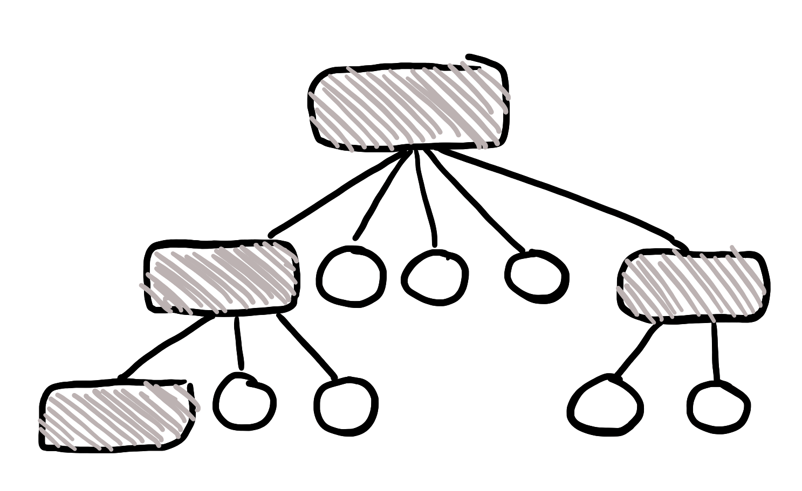
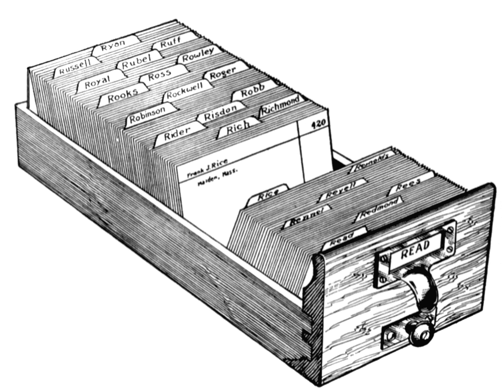
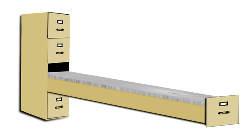
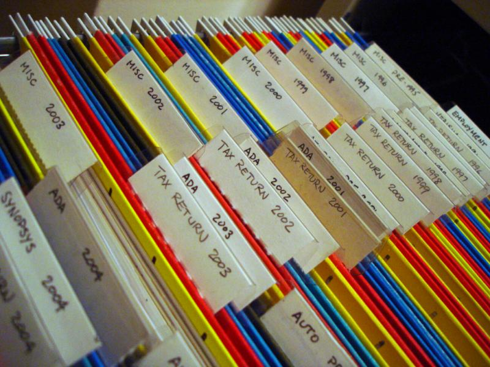

# Choosing a Firestore data structure


<br>

## There are several ways to structure your Firestore data.
- Single Collection
- Multiple Collections
- Subcollections

---

<br>

## Let's explore the pros and cons for each.

<br>

---

<br>

# Single Collection:


## Firestore is a NoSQL database, but a collection is essentailly a parent database table that may or may not have child folders. In a Firestore collection, you can create documents with nested objects like arrays or maps. 

<br>

## A simplified illustration would be a drawer in a file cabinet.

--- 

<br>

### The drawer can be organized with labeled folders.


<br>

---

<br>

### Or... The drawer can be disorganized with random sheets of paper:


---

<br>

## In Firestore, a single collection's file structure can look like this:
```
users
│   
└─── name:
|        └───  first: George
|        └───   last: Smith
|
└─── dob: 1962
|
|
└─── education:
              └─── 0: Elementary School
              └─── 1: Middle School
              └─── 2: High School
              └─── 3: Undergraduate
              └─── 4: Bootcamp
              └─── 5: Masters
              └─── 6: PhD
```

The ```users``` collection has multiple documents with name, dob and education as keys.
<br>
It's like a drawer with the label ```users``` written on it, but the files are not contained in folders at all.
<br>
You can see why this could only work in certain situations.

---

<br>

## Pros:
If you have fixed, static data that won't change over time, a single collection is a great approach. 
<br>
For example:
- Basic user info.
- Archived data for artworks in museums.
- Discography for music releases.

<br>


<br>

## Cons:
A single collection will make it harder to scale when data grows. 
<br>
If you have a large single document, retrieval times will become slower.


<br>

## Just picture a single file cabinet looking like this...


---

<br>

# Multiple collections

## Multiple single depth colletions bring greater organization to data.
The Pros and Cons are pretty similar to a single collection approach.
<br>

However, since single documents are capped at around ```1MB```, it is important to separate data into different documents.

<br>

## Remember, Firestore is a NoSQL database!
This means that it is up to you to brainstorm ways to normalize data <i>beforehand</i>.
<br>
The document IDs are hashed, not auto-incremented, so you will need to get clever with your key-value pairs.

---

<br>

## If you need more info on querying, pagination or ordering/limiting data, here are links:
- [Simple and compound querying:](https://firebase.google.com/docs/firestore/query-data/queries)
- [Order and limit data:](https://firebase.google.com/docs/firestore/query-data/order-limit-data)
- [Pagination:](https://firebase.google.com/docs/firestore/query-data/query-cursors)
- [Managing indices](https://firebase.google.com/docs/firestore/query-data/indexing)

---

<br>

# Subcollections
Subcollections are like child database tables. They are nested within a parent document. If you know ahead of time that data will expand and form relationships, subcollections are a great option.



<br>

A Firestore subcollection could look something like this:

```
departments
|
└─── technology
        |
        └─── managers
        |      |
        |      └─── 5:
        |            |
        |            └─── name:
        |            |        └─── first: Amanda
        |            |        └───  last: Wilson
        |            |
        |            └─── dob: 1962   
        |
        └─── employees
                |
                └─── 162:
                        │   
                        └─── name:
                        |        └───  first: George
                        |        └───   last: Smith
                        |
                        └─── dob: 1982
```

Here, there is a root level collection called ```departments```
<br>
There will likely be many subcollections of departments.
<br>

## Each department can have one employee subcollection of polymorphic user documents that contain something like:
- isManager
- isSuperUser
- isLimited

## Or, each department can have multiple subcollections that separate user type in separate folders.
- Both can be useful depending on the architectural needs and capacity of developers.

<br>

## Pros:
- The parent document's size will not change.
- You get access to full query capabilities.
- You also get to execute [collection group queries](https://firebase.google.com/docs/firestore/query-data/queries).

## Cons:
- You have to manually delete subcollections even when the parent document is deleted...
    - Let's say you have a collection called ```tech_department``` with a subcollection called ```employees```.
        - Even if you delete ```tech_department```, ```employees``` will still exist
        - But you can't query ```employees``` in your React app anymore
        - You have to go to the Firestore console and manually delete ```employees```
- [Here](https://firebase.google.com/docs/firestore/manage-data/delete-data#collections) is the official documentation on deleting subcollections.

<br>

## According to the [Firestore doc]() you can nest subcollections 100 levels deep.
Definitely brainstorm and compartmentalize collections in groupings that make sense to avoid nested hell.


---

<br>

# Now is a great time to brainstorm if you are applying this tutorial to a separate project
### Whiteboard some thoughts and research your needs before you start building!

---

<br>

## If you are good to go, let's dive into the final section:
## [Part 4: CRUD features](./Part%204%3A%20CRUD%20features.md)
