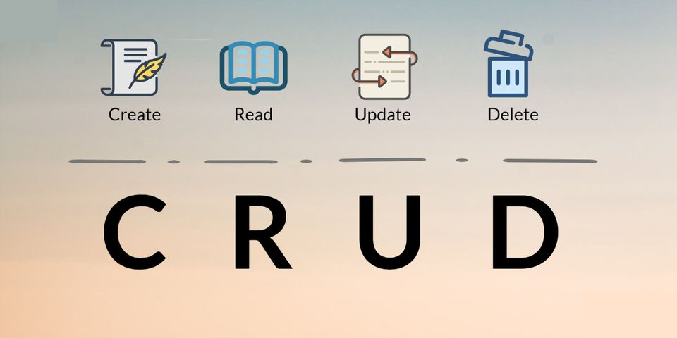

# Welcome to Part 4: CRUD features!


---

<br>

# 1: Sending your first create (POST) request
Sending data to your Firestore database from a React frontend is so simple it's truly wild. If you already have your own form, you are golden. If you just want to set up a quick test, then the ```Create``` directory's ```index.js``` file is ready to go.

Basically, all you have to do is add these imports at the top of the file:
- Fix the import if you have your form nested in a subdirectory within the ```src``` folder.
- ```import { firestore } from "./firebase";```
- ```import { addDoc, collection } from "@firebase/firestore";```

In ```Part 1: Setup```, you initialized a ```firestore``` or ```db``` variable in the ```src``` folder's ```firebase.js``` file so that is a relative import. The ```addDoc()``` and ```collection()``` built-in methods are what we will be employing to define the collection name and send a POST request to Firestore.

--- 

<br>

## Create a reference to pass to the addDoc() method.
- Choose a a name for your new collection - it can be anything you want.
- Next, invoke the collection() built-in method within your functional component.
    - ```const reference = collection(firestore, "enter_a_name_here");```

<br>

--- 

<br>

## Create your asynchronous submission handling function.
You should validate your data in the frontend as well, but this tutorial only includes one text input so that step is left out.

1. Define an object that you want to store in Firestore.
2. i.e. ```let demoData = { text };```
3. Wrap the ```addDoc()``` method in a try catch block.
4. Invoke ```addDoc()``` by passing the ```reference``` variable and the data object you defined.
5. i.e. ```addDoc(reference, demoData);```
6. Handle anything else you need to do like close a modal or console.log a message, etc.
7. Catch any errors with ```catch(err)``` and a console.log(err) or throw a new error.

<br>

---

<br>

## If you submitted a message with the ```Create``` component provided to you, you will see the following message get printed in your Google Chrome dev tools console:

<br>

### ```"You successfully completed your first POST request to your Firestore database."```

<br>

---

<br>

## Check your Firestore document collection page!

<br>

Upon a successful POST, you will see the collection name you defined with 
- ```const reference = collection(firestore, "enter_a_name_here");```

<br>

You will also see a hashed document name such as:
- ```sCVjleXB2hyiis4Y441V```

<br>

And last but not least, you will see your document data!
- ```text: "Your form input."```

<br>


<br>

---

<br>

# <i>Happy hacking! I hope this tutorial was helpful :)</i>

