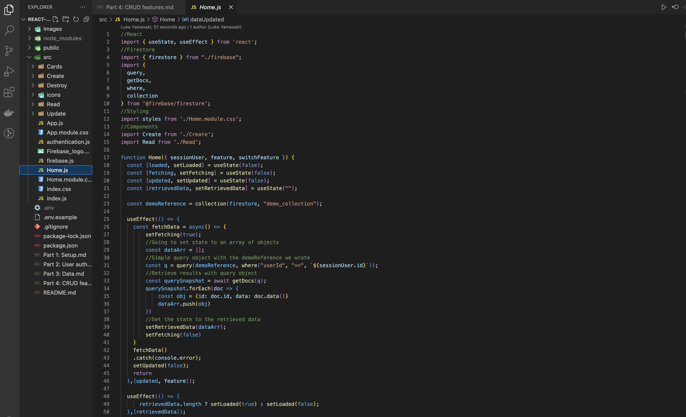

# Welcome to Part 4: CRUD features!


---

<br>

# 1: Setting up data validations (security rules)
You definitely don't want to give everyone permission to perform CRUD operations. You want to check authentication status and credentials.
<br>

Let's walk through setting up rules in the Firestore console.

<br>

## Navigate to your Firestore database console


<br>

## Click on ```Rules``` under the ```Cloud Firestore``` header
The following page with your current rules will load:


<br>

## [Here](https://cloud.google.com/firestore/docs/security/rules-conditions) is a link to the Firestore data validation doc
It is really handy to split your window and follow the official doc side-by-side to check your syntax.


<br>

## Your security rules can be simple or complex
If this app is just for you, then running it on local host and keeping default settings is ok.
<br>

However, if you want to dig into operators, you can employ ```if("variable" in document_name)```, ```==``` or ```!=``` and chain conditionals in ```&&``` to have more strict rules like this:


<br>

## Sometimes we learn about new project requirements and need to edit rules

You can check previous security rules for version control and compare them to the latest version for a better debugging experience:


<br>

## That covers data validation and permissions!
It's so simple in Firestore, but please make sure to also add error handling and data validation in the frontend as well to notify users and add a second layer of defense.

---

<br>

# 2: Sending your first create (POST) request
Sending data to your Firestore database from a React frontend is so simple it's truly wild. If you already have your own form, you are golden. If you just want to set up a quick test, then the ```Create``` directory's ```index.js``` file is ready to go.

Basically, all you have to do is add these imports at the top of the file:
- Fix the import if you have your form nested in a subdirectory within the ```src``` folder.
- ```import { firestore } from "./firebase";```
- ```import { addDoc, collection } from "@firebase/firestore";```

In ```Part 1: Setup```, you initialized a ```firestore``` or ```db``` variable in the ```src``` folder's ```firebase.js``` file so that is a relative import. The ```addDoc()``` and ```collection()``` built-in methods are what we will be employing to define the collection name and send a POST request to Firestore.

--- 

<br>

## Create a reference to pass to the addDoc() method.
- Choose a a name for your new collection - it can be anything you want.
- Next, invoke the collection() built-in method within your functional component.
    - ```const reference = collection(firestore, "enter_a_name_here");```

<br>

--- 

<br>

## Create your asynchronous submission handling function.
You should validate your data in the frontend as well, but this tutorial only includes one text input so that step is left out.

1. Define an object that you want to store in Firestore.
2. i.e. ```let demoData = { userId: sessionUser.id, text };```
3. There are no associations in a NoSQL database, but make sure to pass a session user ID so you can query a collection based on the logged in user.
3. Wrap the ```addDoc()``` method in a try catch block.
4. Invoke ```addDoc()``` by passing the ```reference``` variable and the data object you defined.
5. i.e. ```addDoc(reference, demoData);```
6. Handle anything else you need to do like close a modal or console.log a message, etc.
7. Catch any errors with ```catch(err)``` and a console.log(err) or throw a new error.

<br>

---

<br>

## If you submitted a message with the ```Create``` component provided to you, you will see the following message get printed in your Google Chrome dev tools console:

<br>

### ```"You successfully completed your first POST request to your Firestore database."```

<br>

---

<br>

## Check your Firestore document collection page!

<br>

Upon a successful POST, you will see the collection name you defined with 
- ```const reference = collection(firestore, "enter_a_name_here");```

<br>

You will also see a hashed document name such as:
- ```sCVjleXB2hyiis4Y441V```

<br>

And last but not least, you will see your document data!
- ```text: "Your form input."```
- ```userId: "The session user's ID"```

<br>
The userId below is excluded for security reasons.


<br>

---

# 3: Read the post that you just created
Retrieving data in Firestore is also an easy task. There aren't any associations because it's a NoSQL database, but you still need to query properly. This is where database architecture becomes important.

<br>

## This repo was designed to be a top-heavy application
There are no routes because it's a simple app, but you should consider paginating your requests if you have a large app with a state management library like MobX or Redux. Your store will crash if you query everything.

<br>

## Open the ```Home.js``` file in the ```src``` folder
You will see the following imports at the top of the file:
```
import { 
    query, 
    getDocs, 
    where, 
    collection 
} from '@firebase/firestore'
```

Also, once the user is authenticated in the ```authentication.js``` file, the ```App.js``` file prop drills the user info to various components including the ```Home.js``` file.
<br>

Inside the Home component, there are a number of state variables that handle what gets displayed. 
<br>
These are not too important since you will be customizing them yourself when you have your own project.
<br>

Below them, you will find a ```demoReference``` variable is declared which stores the ```collection``` method's return value. 
<br>
We are passing the ```firestore``` database variable that we imported from ```firebase.js``` and the name of the collection we are going to reference.

<br>

Next, there is a ```useEffect()``` function that retrieves data from Firestore.



Note that we are putting an async function called ```fetchData``` within the ```useEffect()```. 
<br>
In the first line, this function activates a useState variable to display a loading message. 
<br>
Then an empty array called ```dataArr``` gets defined to store incoming data. 
<br>
Another variable called ```q``` is defined to store a simple query object with the ```demoReference``` we defined. 
<br>
The ```demoReference``` we created gets passed to the ```query``` method and we are also specifying which documents to retrieve. 
<br>

In this tutorial's case, string interpolation is being incorporated to find documents where the userId matches the session user's unique ID.

<br>

The ```where``` method was imported at the top of the file and make sure that your syntax is correct. 
<br>
i.e. ```==``` instead of ```===```. Check for typos for the key you are looking for.

<br>

Next, all documents that match the ```q``` query object's criteria are retrieved with the ```getDocs()``` asynchronous method. 
<br>
The results are stored in a variable called ```querySnapshot```. 
<br>
We are going to loop through all documents and store necessary data in an object to push to the empty array we defined earlier. 
<br>
You can ```console.log()``` each document to see the underlying structure.
<br>
Note that you need to invoke the ```.data()``` method to access document data, in this case the user generated message.

<br>

Outside of the ```fetchData``` function, we immediately invoke it and catch any errors.

<br>

Once the data gets retrieved, this component prop drills data to the ```<Read />``` component. 
<br>
This component maps through the ```retrievedData``` array and passes each document or ```event``` to a <DemoCard /> component. 
<br>
It's always important to note that when you loop through data to generate components, you need a unique ID as a ```key``` prop. 
<br>
Avoid incoporating temporary fixes like ```key=idx``` because ```idx``` will definitely cause issues down the road and your app will break. 

---

<br>

# 4: Update the post you created

# 5: Delete your post
The last step in this tutorial is deleting the post you created! 

## Navigate to ```DemoCard.js``` in the ```Cards``` directory. 
At the top of the file, you will see these imports:
```
import { firestore }from "../firebase";
import { doc, deleteDoc } from "firebase/firestore";
```

These are the only Firebase and Firestore tools you need to delete documents!

For this tutorial, the following ```onClick``` function passed to the `````` element with the trash icon handles deleting posts:
```
const handleDelete = async(e) => {
    e.preventDefault();
    await deleteDoc(doc(firestore, "demo_collection", `${event.id}`));
    console.log("You successfully deleted a single document from Firestore.")
    dataUpdated(e);
}
```
<br>

### As you can see, it's so simple!
All you need to do is define an async function and await the ```deleteDoc``` method.
- Inside ```deleteDoc``` invoke ```doc```
- Pass the firestore database imported from firebase.js
- Also pass the name of the collection and the specific file ID
- The document ID is prop drilled in this case

## Note that the security rules in Firestore that you defined earlier limit which docs you can delete
Only documents with your userID can be deleted because you defined this rules in the Firestore console.
# That's it folks you did it!


# <i>Happy hacking! I hope this tutorial was helpful :)</i>

