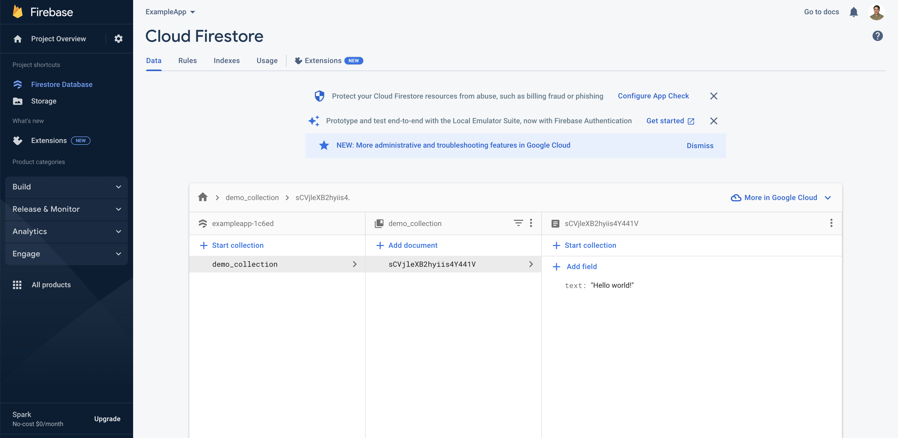

# Getting Started with Firebase, Firestore and React


This project was bootstrapped with [Create React App](https://github.com/facebook/create-react-app).

The root directory is called React-Firebase-Tutorial.

<br>

# 1: Set up Firebase

Let's start with the [Firebase website](https://firebase.google.com/).

Put simply, Firebase is a cloud-based application platform. It's competitors are Parse, MongoDB, Heroku, AWS Amplify, etc. 

There are many tools and frameworks that Firebase offers, and this walkthrough will cover [Firestore](https://cloud.google.com/firestore/docs#:~:text=Firestore%20is%20a%20NoSQL%20document,describes%20relationships%20between%20data%20objects.).
- Firestore is "a NoSQL document database built for automatic scaling, high performance, and ease of application development." 
- Firestore is serverless - no backend code is needed.

* If you would like to research Firebase's other database solution, <i>Realtime Database</i>, you can learn more [here](https://firebase.google.com/docs/database/rtdb-vs-firestore).

Firestore only executes code when an event is triggered. You can write scripts to interact with other products like Google Sheets and you can also send HTTPS requests to store and retrieve data. It's really fast, convenient and pretty cool!

Alright, now that you're at the website, create an account if you haven't or log in to access the dashboard.

---

<br>

## Dashboard

This is what the Firebase dashboard looks like:


<br>

Begin by clicking the "Add Project" card under Your Firebase Projects.
You will see the following page and you can enter a name for your project:


<br>

Once you click continue, step 2 is confirming your Google Analytics selection. We are going to disable this to quickly move forward. However, please look into Google Analytics depending on your project requirements. Here is a link to [Google Analytics](https://analytics.google.com/analytics/web/provision/#/provision).


<br>

It will take a little bit for the project to get initialized. Now's a good time to fill up on coffee, tea, whatever makes you happy!


<br>

---
## Project dashboard
Ok! Once your project is created, you will land on this page.


<br>

There are so many forms and steps involved, but we're almost done with setting up Firebase!
The next thing you need to do is click on the web app ```</>``` button under the "Get started by adding Firebase to your app" header.

The following short form will appear - you just need to give your app a nickname and leave the Firebase Hosting box unchecked for now. If you need Firebase Hosting, check out [this link](https://firebase.google.com/products/hosting?gclid=CjwKCAjws--ZBhAXEiwAv-RNLy56zPOphuzMTXKtA3V11PFk3EwZ8uA2x19qUDrp2rgkbxws2pGWGBoCpe8QAvD_BwE&gclsrc=aw.ds).


<br>

Now you will see a page with two blocks of code to copy. The first is the Firebase npm package. The second one has all of your keys and credentials for this Firebase project. This image is edited for security reasons, but you will see all of your credentials in green wrapped in double quotes. You will want to keep them secure in a .env file.


<br>

Leave this tab open and now let's move on to connecting your Firebase project to your React app!

---

<br>

# 2: Connect Firebase to a React app

In your terminal, bootstrap React with:
- ```npx create-react-app <your project name>```.

Otherwise, this repo comes with a directory called React-Firebase-Tutorial. You're good to go with this basic template.

<br>

### Copy the npm code from the Firebase tab you have open.
If you forgot it, it's here:
- ```npm install firebase```


<br>

### Create a .env file and make sure it is added to your .gitignore file. Don't expose those credentials!
- ```touch .env && code .env```

<br>

Make sure to look at the .env.example file to match the keys for your Firebase credentials. Since we are working with React, make sure the keys start with ```REACT_APP_``` followed by the Firebase keys provided to you in the tab you have open.
- Replace the colons ```:``` with an equal sign ```=``` for all keys.
- Remove the double quotes for credentials and do not leave a comma or semi-colon.

<br>

### Now, create a file called firebase.js in the ```src``` directory.
- ```touch firebase.js && code firebase.js```


Ok perfect! Once the file is open, copy paste the second block of code into this firebase.js file. However, make sure to remove all of your credentials in double quotes with the .env variables.
- It will look like:
```
const firebaseConfig = {
  apiKey: process.env.REACT_APP_API_KEY,
  authDomain: process.env.REACT_APP_AUTH_DOMAIN,
  projectId: process.env.REACT_APP_PROJECT_ID,
  storageBucket: process.env.REACT_APP_STORAGE_BUCKET,
  messagingSenderId: process.env.REACT_APP_MESSAGING_SENDER_ID,
  appId: process.env.REACT_APP_APP_ID
}
```

<br>

### Make sure your .env file is good and the firebase.js file looks like this:


<br>

## Fantastic! Now Firebase and your React app are connected. Let's move on!

---

<br>

# 3: Add Firestore to your Firebase project.
Since this walkthrough covers Firestore, we need to initialize it within our current Firebase project.

<br>

### Go to your Firebase project dashboard.
* Please note that Firestore and Cloud Firestore are the same thing.

You will most likely see <u><i>Cloud Firestore</i></u> on this page as a suggested product. If you don't for some reason, click on the menu on the left navbar, open up the "Build" accordion and select "Firestore Database". If you still don't see the darn thing, you can click the "All products" tile icon and you'll see it listed on the new page. 


---

<br>

## Wait for the banner to load.
Sometime it takes a few seconds for the information within the orange banner to load. Just be patient and you will see the <i>```Create database```</i> button appear.


---

<br>

## Configuring the database
If you see a modal pop up, you're on the right track. This two part form will ask you to select production or test mode, as well a geographical server location. We are going to select test mode, which creates a temporary database that will expire in 30 days. This is just for practice.


---

<br>


## Select a server locaiton
Next, you need to select a server location based on the location of your user or userbase. If you know the region with the highest number of requests, select the best fitting Firestore location to reduce latency and increase reliability. Unfortunately, you cannot change the location once you establish a connection, so choose wisely.


---

<br>

## Loading...
It will take just a few moments for your Firestore database to get created. Another great opportunity for a quick break here!


---

<br>

## Ready to go!
If you're familiar with Postbird, this is basically that but with a cleaner UI. You can manually enter data in a collection here, but we are developers so the next phase will walk you through sending data via a React frontend app.


---

<br>

# 4: Integrating Firestore in React.
Navigate back to the ```firebase.js``` file in your ```src``` directory. We have two more extra lines of code to add here.
#### At the top of the file import ```getFirestore```.
- import { getFirestore } from "@firebase/firestore";
#### At the bottom of the file, export ```firestore```.
- export const firestore = getFirestore(app);

<br>

## Double check that your file matches this image:


<br>

## Light work - Firebase and Firestore are so fast to set up!

---

<br>


## We're almost done folks - let's keep it pushing!

---

<br>

# 5: Sending your first POST request
Sending data to your Firestore database from a React frontend is so simple it is truly wild. If you already have your own form, you are golden. If you just want to set up a quick test, then the ```App.js``` file is ready to go.

Basically, all you have to do is add these imports at the top of the file:
- Fix the import if you have your form nested in a subdirectory within the ```src``` folder.
- ```import { firestore } from "./firebase";```
- ```import { addDoc, collection } from "@firebase/firestore";```

You just initialized firestore in the previous step, so that is a relative import within the ```src``` directory. The ```addDoc()``` and ```collection()``` built-in methods are what we will be employing to define the document collection name and send a POST request to Firestore.

--- 

<br>

## Create a reference to pass to the addDoc() method.
- You will invoke the imported collection() method within your functional component.
- ```const reference = collection(firestore, "enter_a_name_here");```

<br>

--- 

<br>

## Create your asynchronous submission handling function.
You should validate your data in the frontend as well, but this tutorial only includes one text input so that step is left out.

1. Define an object that you want to store in Firestore.
2. i.e. ```let demoData = { text };```
3. Wrap the ```addDoc()``` method in a try catch block.
4. Invoke ```addDoc()``` by passing the ```reference``` variable and the data object you defined.
5. i.e. ```addDoc(reference, demoData);```
6. Handle anything else you need to do like close a modal or console.log a message, etc.
7. Catch any errors with ```catch(err)``` and a console.log(err) or throw a new error.

<br>

---

<br>

## If you followed along successfully, you will see the following message get printed in your Google Chrome dev tools console:

<br>

### ```"You successfully completed your first POST request to your Firestore database."```

<br>

---

<br>

## Check your Firestore document collection page!

<br>

Upon a successful POST, you will see the collection name you defined with 
- ```const reference = collection(firestore, "enter_a_name_here");```

<br>

You will also see a hashed document name such as:
- ```sCVjleXB2hyiis4Y441V```

<br>

And last but not least, you will see your document data!
- ```text: "Your form input."```

<br>



<br>

---

<br>

# <i>Happy hacking! I hope this tutorial was helpful :)</i>


<br>

## Stay tuned for a full CRUD feature walkthrough in this repo soon...